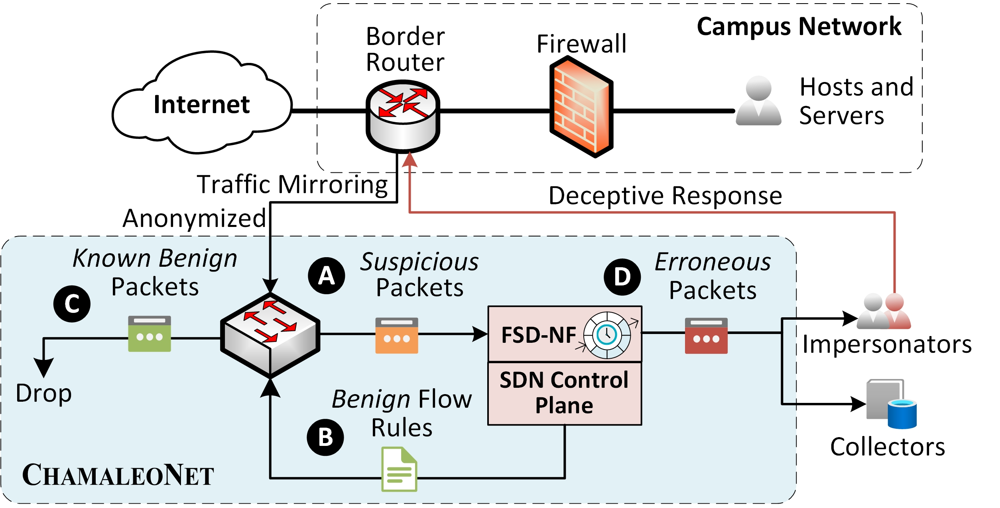

<div align="center">
<h1><span style="font-variant: small-caps;">ChamaleoNet</span>: Programmable Passive Probe for Enhanced Visibility on Erroneous Traffic</h1>

[🤖Overview](#🤖overview) | 
[📦Deployment](#📦deployment) | 
[📚Cite](#📚cite)

[](https://arxiv.org/abs/2508.12496)

</div>

<h2 id="🤖overview">🤖 Overview</h2>



<span style="font-variant: small-caps;">ChamaleoNet</span> is an open-source system that brings visibility into *erroneous traffic* — network requests that go unanswered or generate errors. Unlike traditional monitoring tools that focus on performance metrics, security logs, or unsolicited traffic (e.g., network telescopes), <span style="font-variant: small-caps;">ChamaleoNet</span> highlights an overlooked but critical signal:

- clients connecting to offline or firewalled systems
- misconfigured hosts targeting the wrong servers
- routing issues
- malicious actors probing for vulnerable services.

By capturing and analyzing this class of traffic, <span style="font-variant: small-caps;">ChamaleoNet</span> helps administrators uncover misconfigurations, detect infected internal hosts, and observe external scans more effectively.

This is the code repository for the paper [ChamaleoNet: Programmable Passive Probe for Enhanced Visibility on Erroneous Traffic](https://arxiv.org/), which is under review at IEEE Transactions on Networking.

### ✨ Key Features

- **Erroneous traffic monitoring**: Collects packets that normal systems ignore, offering a new lens into failures, misconfigurations, and attacks.
- **Visibility on external/internal radiation**: Logs radiation from both external hosts (e.g., scans against inactive or firewalled systems) and internal hosts (e.g., misconfigured or compromised devices).
- **Impersonator support**: Can support impersonating inactive hosts or services, engaging scanners like a honeypot.
- **SDN-powered scalability**: Built on programmable switches, filtering are offloaded to the high-speed programmable switches.
- **Privacy by design**: Collects only erroneous packets, strips application payloads, and anonymizes internal IPs where possible.

### 🚀 Why <span style="font-variant: small-caps;">ChamaleoNet</span>?

Traditional monitoring systems:

✅ provide stats on normal traffic (performance, usage),

✅ protect infrastructure against known threats,

✅ log unsolicited traffic on unused subnets (telescopes),

❌ but miss erroneous traffic — a valuable signal for both operations and security.

<span style="font-variant: small-caps;">ChamaleoNet</span> fills this gap by transforming any campus or enterprise network into a flexible, transparent monitor for erroneous traffic, without interfering with regular operations.

<h2 id="📦deployment">📦 Deployment</h2>

### Requirements

#### Hardware requirements

As shown in the figure above,  <span style="font-variant: small-caps;">ChamaleoNet</span>  depends on a programmable switch (e.g., we use P4-based [Intel Tofino](https://www.intel.com/content/www/us/en/products/network-io/programmable-ethernet-switch.html)) and a server hosting the control plane and FSD-NF. There should be a dedicated port on the switch connected to the server, serving as data path. Control path requires a connection to the switch via gRPC. The collector can either be hosted at the same server or a dedicated server connected to the FSD-NF.

#### Software requirements

- gcc compiler
- Libpcap
- P4 compiler (tofino-p4c)
- Python 3.x
- libpython3-dev
- BFrt gRPC client library

### Build

To install <span style="font-variant: small-caps;">ChamaleoNet</span>, follow:

1. **Configuration**

- Edit the `conf/net.internal` and `conf/net.responder` files to specify the subnets to monitor.
- Edit the `conf/param.h` file to set the parameters for the FSD-NF, such as sizing the data structures, and setting the port to be monitored.
- Edit the `p4_src/p4include/definition.p4` and `p4_src/bfrt_setup.py` to set P4-side parameters, such as the switch local port number, and target IP ranges.

2. **Compile and start P4 program**

```bash
<your p4 build cmd> p4_src/tf_honeypot.p4
<your p4 start cmd> -p tf_honeypot # Start the P4 program and enter the BFrt shell

bfshell> bfrt_python p4_src/bfrt_setup.py false # Set up the tables and ports on the switch
``` 

3. **Compile and start the FSD-NF**

```bash
make 
sudo ./bin/tsdn # raw packet capturing requires root privileges
```

4. **Start the packet collection**

```bash
tcpdump -i <interface> -w <output_file>
```

### Project Structure

```bash
├── src
│   ├── bfrt_grpc.c # Interface to the Python-based BFrt controller
│   ├── data_structure.c # Data structures for packet handling
│   ├── ip.c # Utilities for IP address handling
│   ├── log.c # Logging utilities
│   ├── param.h # Configuration parameters
│   ├── pkt_handle.c # Packet handling logic
│   ├── struct.h # Header file for data structures
│   ├── tsdn.c # Main logic for the project
│   ├── tsdn.h # Header file for main logic
│   └── utils.c # Utility functions
├── bfrt_grpc
│   ├── bfrt_grpc_client.py # Python client for BFrt gRPC
├── conf
│   ├── net.internal # Subnets to be monitored
│   └── net.responder # Subnets to skip buffering
├── LICENSE
├── Makefile # Makefile for building the project
├── p4_src # P4 source files for the programmable switch
│   ├── p4include
│   │   ├── definition.p4
│   │   ├── egress.p4
│   │   ├── header.p4
│   │   └── ingress.p4
│   ├── tf_honeypot.p4 # P4 program for the honeypot functionality
│   └── bfrt_setup.py # set up the tables and ports on the switch
```

<h2 id="📚cite">📚 Cite</h2>

```bibtex
@misc{wang2025chamaleonet,
      title={ChamaleoNet: Programmable Passive Probe for Enhanced Visibility on Erroneous Traffic}, 
      author={Zhihao Wang and Alessandro Cornacchia and Andrea Bianco and Idilio Drago and Paolo Giaccone and Dingde Jiang and Marco Mellia},
      year={2025},
      eprint={2508.12496},
      archivePrefix={arXiv},
      primaryClass={cs.CR},
      url={https://arxiv.org/abs/2508.12496}, 
}
```

# Acknowledgement

The network infrastructure used in this work was supported by the [SUP4RNET](https://sup4rnet.github.io/) at Politecnico di Torino, Italy. Thanks to all authors for their contributions to <span style="font-variant: small-caps;">ChamaleoNet</span>.


# Licence

Licensed under the MIT license.